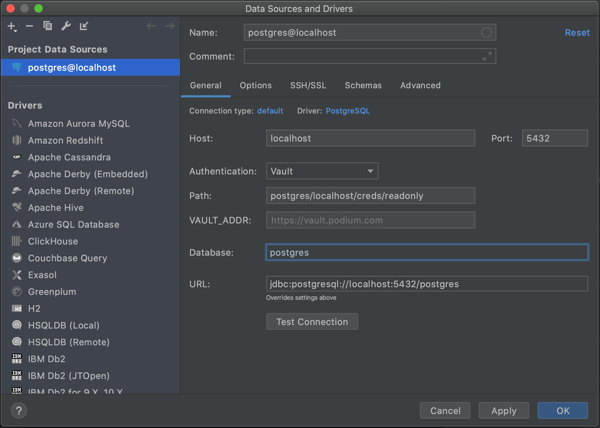

# Vault

<!-- Plugin description -->
Fetches credentials for a database from Vault.

This plugin assumes that [vault](https://learn.hashicorp.com/tutorials/vault/getting-started-install?in=vault/getting-started) is installed and available.
The currently supported authentication methods are [OIDC](https://www.vaultproject.io/docs/auth/jwt) (web browser flow) and [OKTA](https://www.vaultproject.io/docs/auth/okta)

## Usage
For global Vault configuration edit your preferences under <kbd>Settings/Preferences</kbd> > <kbd>Tools</kbd> > <kbd>Vault</kbd>.

To set up a new connection using Vault add or edit a Data Source to use
*Vault* in the authentication dropdown.

<kbd>File</kbd> > <kbd>New</kbd> > <kbd>Data Source</kbd>

<!-- Plugin description end -->

## Installation

- Using IDE built-in plugin system:
  
  <kbd>Settings/Preferences</kbd> > <kbd>Plugins</kbd> > <kbd>Marketplace</kbd> > <kbd>Search for "Vault"</kbd> >
  <kbd>Install Plugin</kbd>
  
- Manually:

  Download the [latest release](https://github.com/davidsteinsland/postgres-vault-auth/releases/latest) and install it manually using
  <kbd>Settings/Preferences</kbd> > <kbd>Plugins</kbd> > <kbd>⚙️</kbd> > <kbd>Install plugin from disk...</kbd>
  
## Screenshots
Global Vault configuration.
<kbd>Settings/Preferences</kbd> > <kbd>Tools</kbd> > <kbd>Vault</kbd>

Set up or edit a connection using Vault.

<kbd>File</kbd> > <kbd>New</kbd> > <kbd>Data Source</kbd>

  
### Vault SVG Logo

* [Source](https://worldvectorlogo.com/logo/vault-enterprise)
* [Terms of use](https://worldvectorlogo.com/terms-of-use)